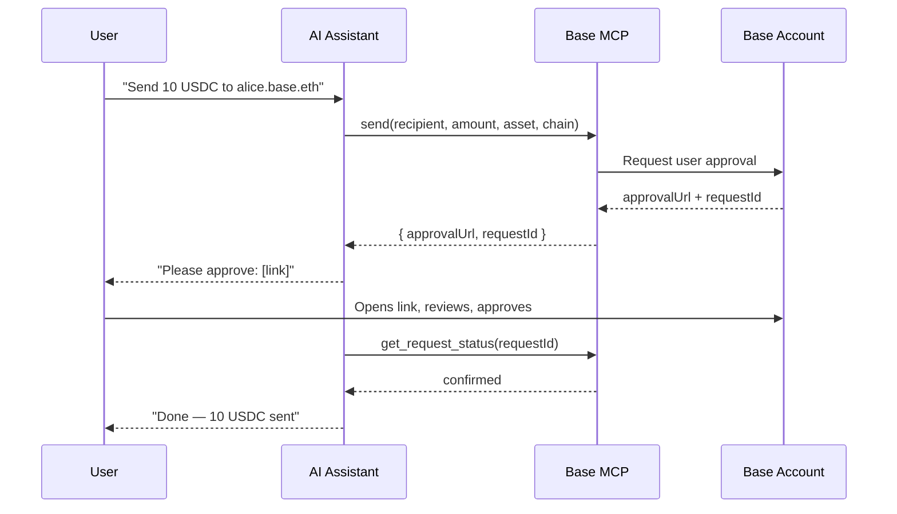

import { WalletSetupDemo } from "/snippets/WalletSetupDemo.jsx"

Base MCP gives your AI assistant direct access to your [Base Account](/base-account) (the smart wallet powering the Base App). Connect once and your assistant can check balances, send funds, swap tokens, sign messages, execute contract calls, and pay x402-enabled APIs across multiple networks. Every write action requires your approval.

## Demo

<Visibility for="humans">
  <WalletSetupDemo />
</Visibility>

## How it works

## What you can do

<CardGroup cols={2}>
  <Card title="Send & receive" icon="paper-plane">
    Send native tokens or ERC-20 tokens to addresses, ENS names, basenames, and cb.id names.
  </Card>
  <Card title="Swap tokens" icon="arrows-rotate">
    Swap supported tokens on supported mainnet chains directly from your assistant.
  </Card>
  <Card title="Sign messages and typed data" icon="pen-nib">
    Sign EIP-712 typed data and plain messages for authentication and protocol interactions.
  </Card>
  <Card title="Execute contract calls" icon="code">
    Batch multiple contract interactions into a single user approval.
  </Card>
  <Card title="Pay x402 APIs" icon="credit-card">
    Pay for x402-enabled API requests with USDC on Base or Base Sepolia.
  </Card>
</CardGroup>

## Get started

<CardGroup cols={2}>
  <Card title="Quickstart" icon="bolt" href="/ai-agents/quickstart">
    Connect mcp.base.org to your AI assistant in under 5 minutes.
  </Card>
  <Card title="Guides" icon="book-open" href="/ai-agents/guides">
    Step-by-step guides for sending, swapping, checking balance, and more.
  </Card>
  <Card title="Plugins" icon="puzzle-piece" href="/ai-agents/plugins">
    How the Base MCP skill works and how plugins like Morpho, Moonwell, Uniswap, Avantis, Aerodrome, Virtuals, and Bankr extend it.
  </Card>
  <Card title="Custom plugins" icon="puzzle-piece" href="/ai-agents/plugins/custom-plugins">
    Build your own plugin that produces unsigned calldata and executes through Base MCP's send_calls.
  </Card>
</CardGroup>
