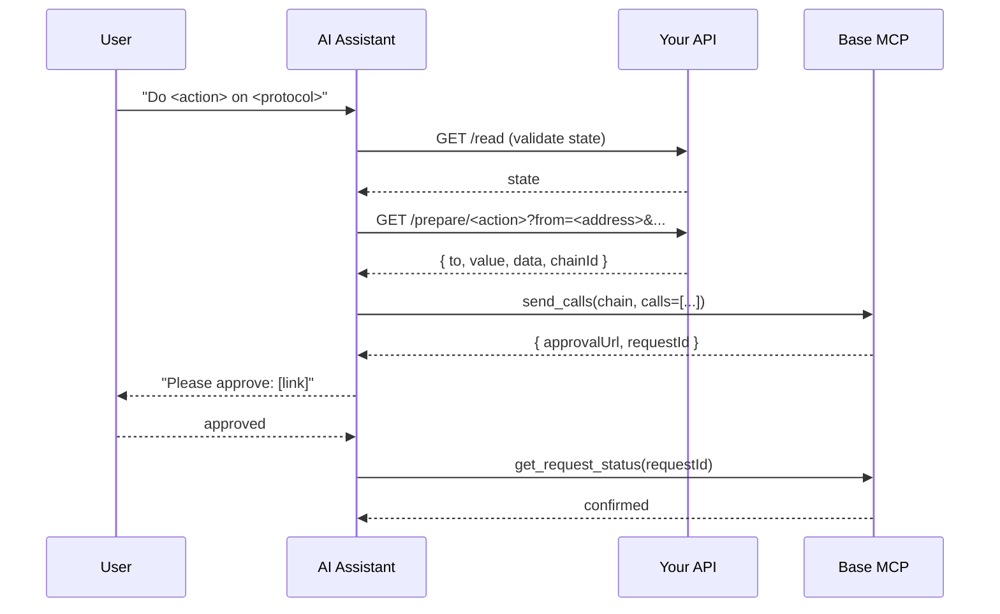

A plugin is a markdown spec that teaches your assistant how to call an external API, run a CLI, or call another MCP server, translate the response into a Base MCP action, and execute it through tools like `send_calls`, `swap`, or `sign`. The calldata-based [native plugins](/ai-agents/plugins/native) follow the same shape. This page shows how to write your own `send_calls`-based plugin.

## When you need one

Write a plugin when your protocol has an HTTP tx-builder, a CLI/SDK that can produce unsigned transactions, or its own MCP server. CLI/SDK-only plugins require a harness with shell access; hybrid plugins can prefer a CLI in coding harnesses and fall back to an MCP server in chat-only Claude or ChatGPT consumer apps.

## Anatomy of a plugin

A `send_calls`-based plugin file contains four sections:

<Steps>
  <Step title="Onboarding gate">
    A `STOP` notice that forces the assistant to complete Base MCP onboarding (`get_wallets`, disclaimer) before doing anything else. The user's wallet address — needed for every prepare call — is only confirmed during detection.
  </Step>
  <Step title="Read endpoints">
    Document the GET endpoints or CLI commands that return state — balances, positions, market data — and the units they use.
    <Note>
    POST endpoints are not supported in Claude and ChatGPT consumer apps.
    </Note>
  </Step>
  <Step title="Prepare endpoints">
    Document the endpoints, CLI commands, or MCP tools that return unsigned calldata. State the exact response shape so the assistant knows which fields map to `to`, `value`, and `data`.
  </Step>
  <Step title="send_calls mapping">
    Show the assistant how to convert the prepare response into the `calls` array passed to `send_calls`.
  </Step>
</Steps>

<Note>
Base MCP's `web_request` tool can make GET and POST requests only to allowlisted partner APIs. Native plugins that rely on HTTP hosts may be allowlisted for the hosted MCP, while CLI-only plugins require shell access unless they document an MCP fallback. Custom plugin hosts usually are not allowlisted, so custom plugins should expose GET endpoints only if they need to remain usable in Claude and ChatGPT consumer apps.
</Note>

## How it works



## Build it

### 1. Pick a response shape

Your prepare endpoint should return a single object with the fields `send_calls` needs. Two common shapes:

**Envelope** (Avantis-style):

```json
{
  "ok": true,
  "data": {
    "to": "0x...",
    "value": "0x0",
    "data": "0x...",
    "chainId": 8453
  }
}
```

**Ordered batch** (Moonwell-style) — for when approval, enter-market, and the action are separate calls:

```json
{
  "transactions": [
    { "step": "approve", "to": "0x...", "data": "0x...", "value": "0x0", "chainId": 8453 },
    { "step": "action",  "to": "0x...", "data": "0x...", "value": "0x0", "chainId": 8453 }
  ]
}
```

Either works. The batch shape is preferable when allowance or registration steps must run before the action — `send_calls` executes them atomically in one approval.

### 2. Write the plugin spec

Use this template as `plugins/my-protocol.md` in your skill, or as an `.mdx` page if you're publishing docs.

````markdown
# My Protocol Plugin

> [!IMPORTANT]
> ## STOP — COMPLETE ONBOARDING BEFORE USING THIS PLUGIN
>
> Before calling any My Protocol endpoint, you MUST complete the Base MCP onboarding flow:
> 1. Call `get_wallets` (Detection)
> 2. Present wallet status and disclaimer (Onboarding)
>
> The user's wallet address — required by every prepare call — is only confirmed during Detection.

My Protocol is a <one-line description>. Fetch unsigned calldata from the My Protocol API, then execute via Base MCP's `send_calls`.

**Fetching calldata:** the My Protocol API is not on the Base MCP `web_request` allowlist. Construct the prepare URL as a GET with all parameters in the query string. If `web_request` rejects it, fetch through whatever capability the harness exposes, or ask the user to paste the response into the chat. Then continue with `send_calls`.

**Supported chain:** Base mainnet (`8453` / `0x2105`).

---

## Read endpoints

```
GET https://api.myprotocol.xyz/v1/state/<address>
```

## Prepare endpoint

```
GET https://api.myprotocol.xyz/v1/prepare/<action>?from=<address>&amount=<decimal>
```

Response:

```json
{
  "transactions": [
    { "step": "approve", "to": "0x...", "data": "0x...", "value": "0x0", "chainId": 8453 },
    { "step": "action",  "to": "0x...", "data": "0x...", "value": "0x0", "chainId": 8453 }
  ]
}
```

## send_calls mapping

Pass every `transactions[*]` to `send_calls`:

```json
{
  "chain": "base",
  "calls": [
    { "to": "<tx.to>", "value": "<tx.value>", "data": "<tx.data>" }
  ]
}
```

## Orchestration pattern

```
1. get_wallets -> address
2. Fetch GET /state/<address> -> validate balances/preconditions
3. Fetch GET /prepare/<action>?from=<address>&amount=<decimal>
   (if web_request rejects the host, fetch directly or ask the user to paste the JSON)
4. send_calls(chain="base", calls from transactions[])
5. User approves -> get_request_status(requestId)
```
````

### 3. Wire it into `send_calls`

The contract between your prepare endpoint and Base MCP is exactly this object:

```json
{
  "chain": "base",
  "calls": [
    { "to": "0x...", "value": "0x0", "data": "0x..." }
  ]
}
```

Use Base MCP's chain names (`base`, `base-sepolia`, `ethereum`, `optimism`, `polygon`, `arbitrum`, `bsc`, or `avalanche`) when calling `send_calls`. If a prepare endpoint returns a numeric or hex `chainId`, map it to the corresponding chain name before calling Base MCP. `value` defaults to `0x0` if omitted. The assistant calls `send_calls` once with the full batch — the user approves once, and all calls execute atomically.

## Patterns to copy

| Pattern | When to use | Example |
|---------|-------------|---------|
| Single-call envelope | One action, one tx | [Avantis](https://github.com/base/skills/blob/master/skills/base-mcp/plugins/avantis.md) |
| Ordered batch | Approval + action must be atomic | [Moonwell](https://github.com/base/skills/blob/master/skills/base-mcp/plugins/moonwell.md) |
| CLI-only prepared batch | Protocol CLI produces calldata; no MCP fallback needed | [Aerodrome](https://github.com/base/skills/blob/master/skills/base-mcp/plugins/aerodrome.md) |
| CLI or MCP prepared batch | Prefer a protocol CLI when shell access exists; fall back to an MCP server on chat-only surfaces | [Morpho](https://github.com/base/skills/blob/master/skills/base-mcp/plugins/morpho.md) |
| Multi-endpoint flow | Quote, approve, swap as separate calls | [Uniswap](https://github.com/base/skills/blob/master/skills/base-mcp/plugins/uniswap.md) |
| Discovery API + swap | Read-only feed selects the token; `swap` executes the purchase | [Bankr](https://github.com/base/skills/blob/master/skills/base-mcp/plugins/bankr.md) |
| MCP server + SIWE session auth | Protocol has its own MCP server; Base MCP wallet signs the login challenge | [Virtuals](https://github.com/base/skills/blob/master/skills/base-mcp/plugins/virtuals.md) |
## Related

<CardGroup cols={2}>
  <Card title="Execute contract calls" icon="code" href="/ai-agents/guides/batch-calls">
    Full guide to `send_calls` and batching.
  </Card>
  <Card title="Native plugins" icon="puzzle-piece" href="/ai-agents/plugins/native">
    Reference implementations for ordered-batch, CLI/MCP-prepared, and multi-endpoint patterns.
  </Card>
</CardGroup>
