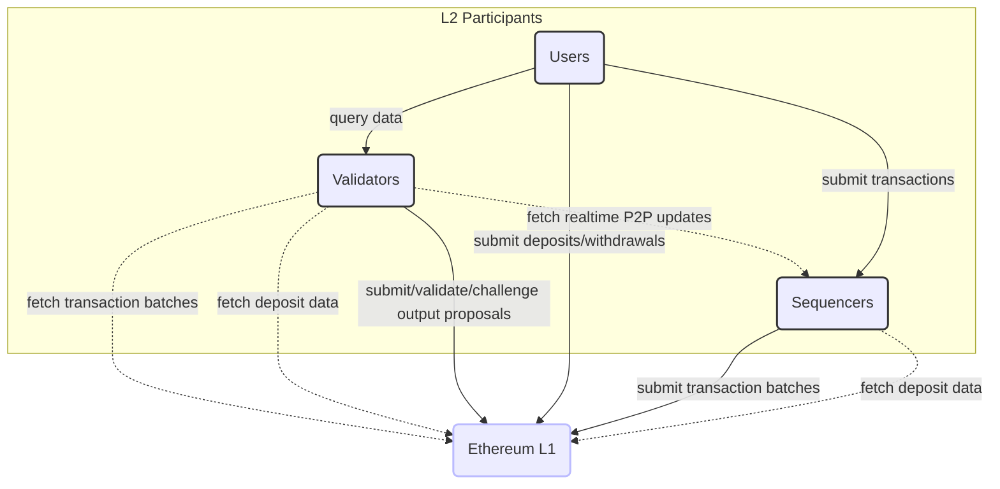
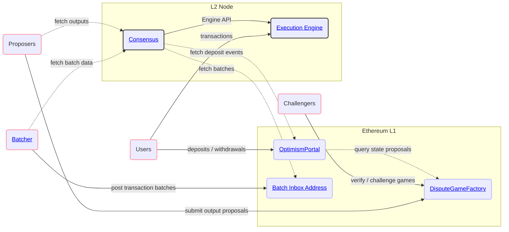
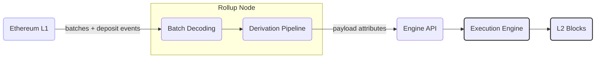
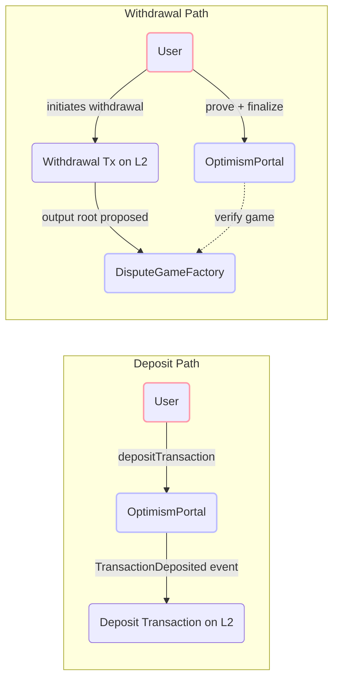
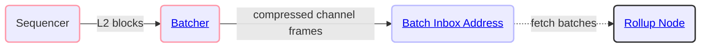
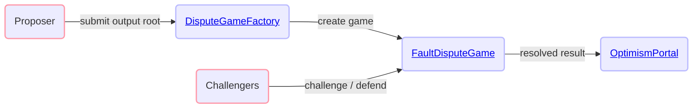
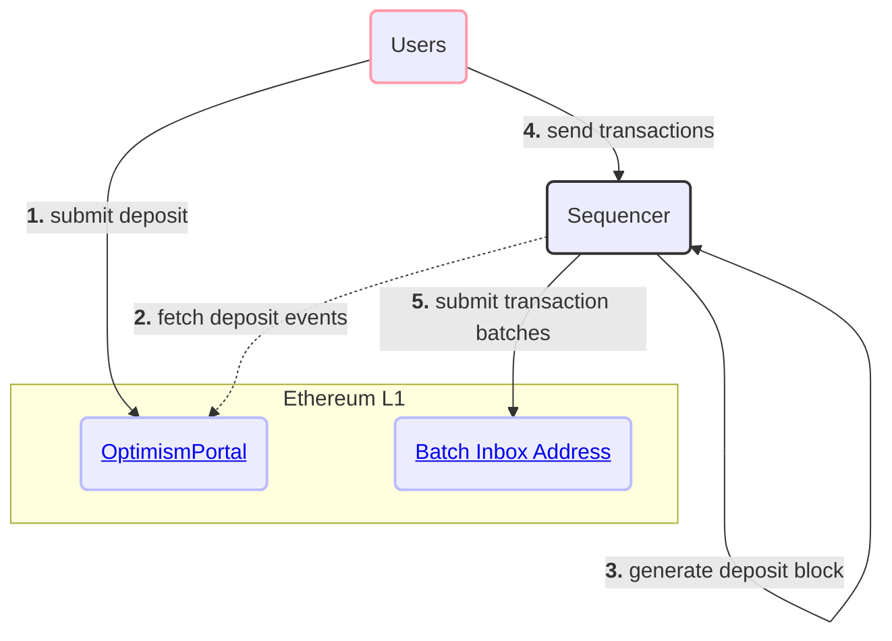
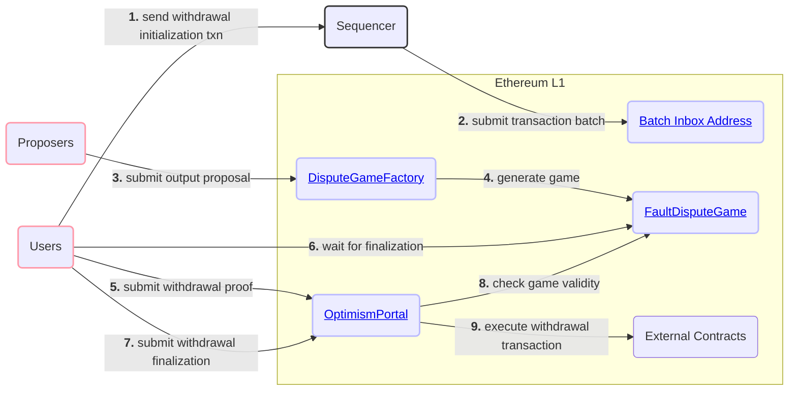

Base is a rollup built on Ethereum. L2 transaction data is posted to Ethereum for data availability,
and proofs allow anyone to challenge invalid state transitions. This page gives a high-level tour of the
protocol components and the core user flows.

## Network Participants

There are three primary actors that interact with Base: users, sequencers, and validators.

### Users

Users are the general class of network participants who:

- Submit transactions through the sequencer or by interacting with contracts on Ethereum.
- Query transaction data from interfaces operated by validators.

### Sequencers

The sequencer fills the role of block producer on Base. Base currently operates with a single active sequencer.

The Sequencer:

- Accepts transactions directly from Users.
- Observes "deposit" transactions generated on Ethereum.
- Consolidates both transaction streams into ordered L2 blocks.
- Submits information to L1 that is sufficient to fully reproduce those L2 blocks.
- Provides real-time access to pending L2 blocks that have not yet been confirmed on L1.
- Produces Flashblocks every 200ms, committing to the ordering of transactions within the block as it is being built.

The Sequencer serves an important role for the operation of an L2 chain but is not a trusted actor. The Sequencer is generally
responsible for improving the user experience by ordering transactions much more quickly and cheaply than would currently
be possible if users were to submit all transactions directly to L1.

### Validators

Validators execute the L2 state transition function independently of the Sequencer. Validators help to maintain
the integrity of the network and serve blockchain data to Users.

Validators generally:

- Sync rollup data from L1 and the Sequencer.
- Use rollup data to execute the L2 state transition function.
- Serve rollup data and computed L2 state information to Users.

Validators can also act as Proposers and/or Challengers who:

- Submit assertions about the state of the L2 to a smart contract on L1.
- Validate assertions made by other participants.
- Dispute invalid assertions made by other participants.

## High-Level System Diagram

The following diagram shows how the major protocol components interact across L1 and L2.

## Protocol Components

### Consensus

Consensus is responsible for deriving the canonical L2 chain from L1 data. It reads transaction batches
from the Batch Inbox and deposit events from OptimismPortal, constructs payload attributes, and drives the
execution engine via the Engine API. Unsafe (unconfirmed) blocks are gossiped to other nodes over a dedicated
P2P network to give validators low-latency access before batches land on L1.

[Consensus →](./consensus/)

### Execution

The execution engine is a Reth-based runtime. It exposes the standard Ethereum JSON-RPC API and
processes blocks produced by consensus. Predeploys (system contracts at fixed L2 addresses), precompiles,
and preinstalls extend the EVM for rollup-specific functionality such as fee distribution, L1 block attribute
injection, and cross-domain messaging.

[Execution →](./execution/)

### Bridging

Deposits flow from the `OptimismPortal` contract on L1 into L2 as special deposit transactions included at the
start of each L2 block. Withdrawals flow in the opposite direction: a withdrawal transaction is initiated on L2,
a proposer submits an output root to `DisputeGameFactory`, and after the challenge period the user proves and
finalizes the withdrawal on L1 via `OptimismPortal`.

[Bridging →](./bridging/deposits)

### Batcher

The batcher is a service run by the sequencer that compresses L2 transaction data into channel frames and posts
them as calldata (or blobs) to the Batch Inbox Address on L1. This is the data availability layer that allows
any validator to independently reconstruct the L2 chain from L1.

[Batcher →](./batcher)

### Proofs

Output proposals and proofs allow permissionless verification of the L2 state. Anyone can propose an
output root to the `DisputeGameFactory`, and anyone can challenge it. Disputes are resolved by the `FaultDisputeGame`
contract using the Cannon VM for on-chain execution tracing of disputed state transitions. Valid withdrawals can
only be finalized through `OptimismPortal` once the associated dispute game resolves in favor of the proposer.

[Proofs →](./fault-proof/)

## Core User Flows

### Depositing ETH to Base

Users will often begin their L2 journey by depositing ETH from L1.
Once they have ETH to pay fees, they'll start sending transactions on L2.
The following diagram demonstrates this interaction and key Base protocol components.

### Sending Transactions on Base

Sending transactions on Base works the same as on Ethereum. Users sign transactions and submit them via
`eth_sendRawTransaction` to any node's JSON-RPC endpoint. The sequencer picks them up from its mempool,
orders them into L2 blocks, and eventually posts the batch to L1.

### Withdrawing from Base

Users may also want to withdraw ETH or ERC20 tokens from Base back to Ethereum. Withdrawals are initiated
as standard transactions on L2 but are then completed using transactions on L1. Withdrawals must reference a valid
`FaultDisputeGame` contract that proposes the state of the L2 at a given point in time.

